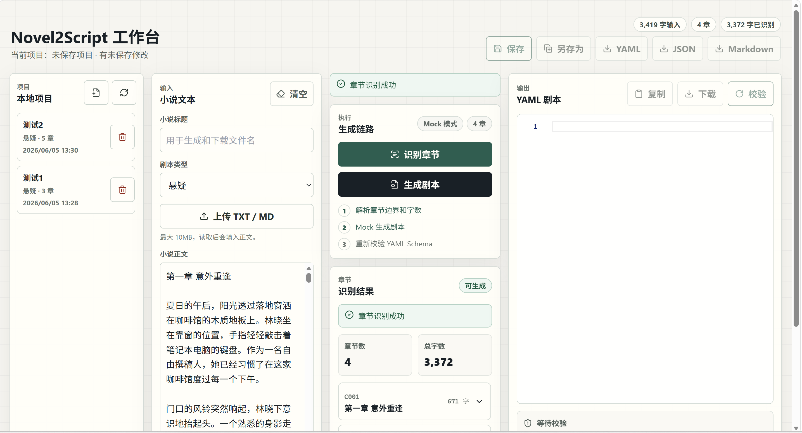
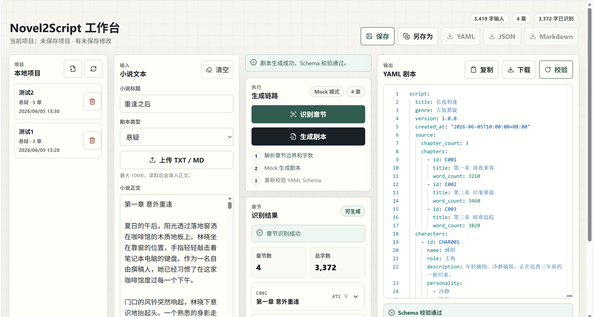
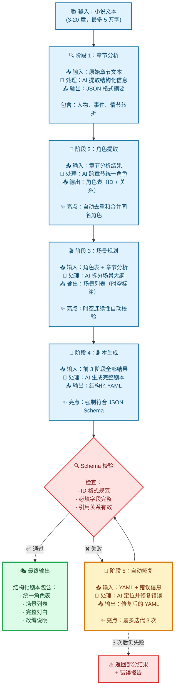
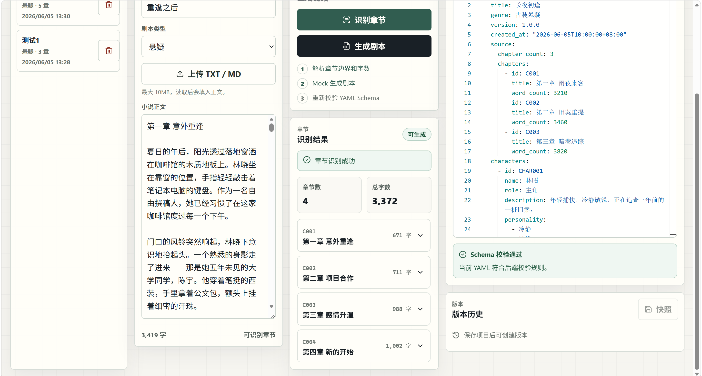
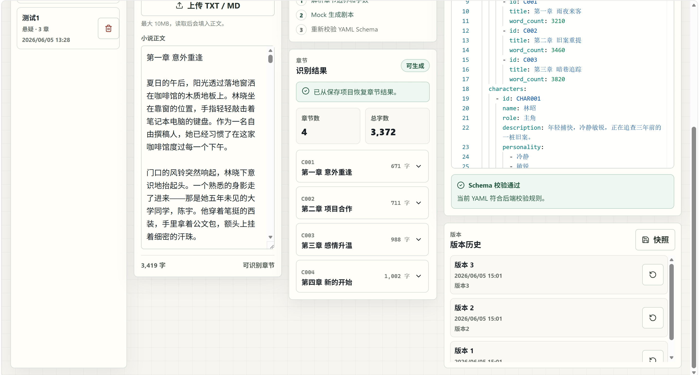
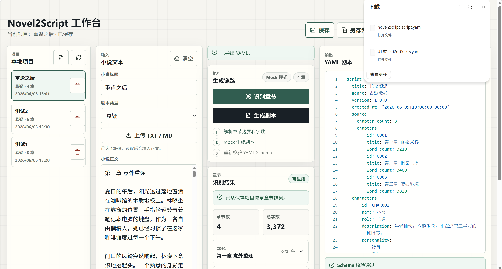
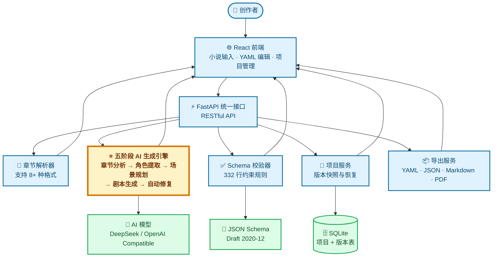

<div align="center">

# 📖 Novel2Script

### AI 驱动的智能小说剧本转换系统

**让每一个故事都能成为精彩剧本**

[](https://www.python.org/)
[](https://fastapi.tiangolo.com/)
[](https://reactjs.org/)
[](https://www.typescriptlang.org/)
[](https://github.com/wswhhhc/novel2script/actions/workflows/ci.yml)
[](LICENSE)

<br>

## 🚀 在线 Demo / 评审入口

> **已部署在线服务**：评审可直接访问工作台、后端健康检查和 Swagger API 文档。

<table align="center">
  <tr>
    <td align="center" width="300">
      <strong>🎭 Novel2Script 工作台</strong><br><br>
      <a href="http://120.53.0.252/novel2/">
        
      </a>
    </td>
    <td align="center" width="300">
      <strong>⚡ 后端 API 健康检查</strong><br><br>
      <a href="http://120.53.0.252/novel2-api/health">
        
      </a>
    </td>
    <td align="center" width="300">
      <strong>📋 API 文档（Swagger）</strong><br><br>
      <a href="http://120.53.0.252/novel2-api/docs">
        
      </a>
    </td>
  </tr>
</table>

> 💡 点击以上链接会在当前页跳转，按住 **Ctrl**（Mac：**Cmd**）点击可在新标签页打开。

### 建议评审路径

| 步骤 | 操作 | 可验证结果 |
|------|------|------------|
| 1 | 打开 Novel2Script 工作台，输入工作区名称（如 `demo`） | 弹窗提示「进入工作区」 |
| 2 | 点击顶栏 **「快速演示」** 按钮 | 自动加载演示小说、识别章节 |
| 3 | 点击「生成剧本」| 流式生成 YAML，右侧出现 **角色关系图** |
| 4 | 切换 **🌙 暗色模式** 查看效果 | 全局主题切换 |
| 5 | 保存项目，导出 YAML/JSON/Markdown/PDF | 验证版本管理和多格式导出 |

<br>

[功能演示](#-功能演示) • [快速开始](#-快速开始) • [技术架构](#-技术架构) • [项目结构](#-项目结构) • [核心特性](#-核心特性) • [Docker 部署](#-docker-部署)

---

## 🎥 演示视频

**完整功能演示（4分钟）**：

[](https://www.bilibili.com/video/BV1F37C6iE4v)

视频展示从小说上传到剧本导出的完整流程，包括智能章节识别、五阶段AI生成、YAML编辑、版本管理和多格式导出等核心功能。

</div>

---

## 📋 项目简介

**Novel2Script** 是一个面向小说作者、编剧初学者和短剧创作者的 AI 辅助剧本创作平台。项目围绕“小说文本如何变成可编辑、可校验、可导出的剧本初稿”设计了**五阶段 AI 生成流程**和**结构化 YAML Schema**，让大模型输出从普通文本变成可持续迭代的创作资产。

### 3 分钟看懂项目

| 评审关注点 | 项目回答 |
|------------|----------|
| **解决什么问题** | 小说改编剧本门槛高、格式难统一、AI 直接生成结果难维护 |
| **核心方案** | 章节分析 → 角色提取 → 场景规划 → 剧本生成 → Schema 校验/自动修复 |
| **主要产物** | 结构化 YAML 剧本，可编辑、可校验，可导出 YAML/JSON/Markdown/PDF |
| **工程支撑** | FastAPI + React + SQLite，Mock/AI 双模式，GitHub Actions 持续集成 |
| **验证方式** | 后端单元/接口测试、前端组件测试、Playwright E2E、smoke test |

### 🎯 核心价值

| 痛点 | 解决方案 | 价值 |
|------|---------|------|
| 📝 **小说改编门槛高** | AI 五阶段智能分析（章节→角色→场景→剧本→修复） | 快速生成可继续打磨的结构化初稿 |
| 🎭 **剧本格式复杂** | 严格的 YAML Schema 校验 + 可视化编辑器 | 让输出格式可检查、可修复、可复用 |
| 🔄 **迭代成本高** | 版本快照 + 一键恢复 + 多格式导出 | 灵活管理创作过程 |
| 🚀 **上手学习慢** | Mock 模式演示 + 示例数据 + 完整文档 | 零成本体验完整流程 |

---

## 🎬 功能演示

### 1️⃣ 智能章节识别

系统自动识别多种中英文章节格式，精准提取标题和内容。



**支持格式**：
- 中文：`第一章 标题` / `第1章 标题`
- 英文：`Chapter 1: Title` / `Chapter One: Title`
- 数字编号：`1. 标题` / `01. 标题`
- 特殊符号：`【1】标题` / `（1）标题`

---

### 2️⃣ AI 五阶段剧本生成

面向小说改编场景设计的多阶段生成流程，用中间结构和 Schema 校验提升输出稳定性。





| 阶段 | 输入 | 输出 | 技术亮点 |
|------|------|------|---------|
| **阶段 1：章节分析** | 小说文本 | 结构化摘要、人物、事件 | JSON Schema 强制输出结构 |
| **阶段 2：角色提取** | 章节分析结果 | 统一角色表（ID、关系图） | 跨章节人物去重与合并 |
| **阶段 3：场景规划** | 角色表 + 章节分析 | 场景拆分大纲 | 时空连续性自动校验 |
| **阶段 4：剧本生成** | 前 3 阶段结果 | 完整 YAML 剧本 | 符合 JSON Schema 约束 |
| **阶段 5：自动修复** | 校验错误 | 修复后的 YAML | 最多 3 次迭代修复 |

---

### 3️⃣ 可视化 YAML 编辑器

基于 Monaco Editor 的专业编辑体验，支持实时语法高亮和错误提示。



**核心功能**：
- ✅ 语法高亮和自动补全
- ✅ 实时 Schema 校验（基于 `schemas/script.schema.json`）
- ✅ 可读错误提示（中文本地化）
- ✅ 一键复制/下载

---

### 4️⃣ 项目与版本管理

类似 Git 的版本控制系统，保护创作成果。



**核心能力**：
- 💾 SQLite 本地持久化
- 📦 项目列表管理（创建/打开/删除）
- 🕰️ 版本快照（命名 + 备注）
- ⏮️ 一键恢复到历史版本
- 🔒 防止意外数据丢失

---

### 5️⃣ 多格式导出

满足不同场景的输出需求。



| 格式 | 用途 | 特点 |
|------|------|------|
| **YAML** | 机器可读、版本控制 | 原始格式，保留完整结构 |
| **JSON** | API 集成、数据处理 | 标准化数据交换格式 |
| **Markdown** | 人类阅读、打印分享 | 格式化排版，包含角色表、场景列表 |
| **PDF** | 答辩展示、打印归档 | 封面、角色表、场景与对白排版（支持中文字体） |
| **Word** | 文档编辑 | 待开发 |

---

## 🏗️ 技术架构

> 💡 **核心设计**：五阶段 AI 生成链路 + 332 行 Schema 约束，把大模型输出纳入可校验、可编辑、可导出的工程流程。

### 系统架构图



#### 架构说明

本架构图展示了 Novel2Script 的核心技术组件和数据流向：

**核心创新**：
- ⭐ **五阶段 AI 生成引擎**：以章节、角色、场景、剧本和修复分层处理，降低单次生成带来的结构漂移
- 📐 **332 行 Schema 约束**：严格的结构化输出规范，保证剧本质量
- 💾 **版本快照系统**：类 Git 的版本管理，保护创作成果

**数据流向**：
1. 用户上传小说 → 章节解析器识别结构（支持 8+ 种中英文格式）
2. 触发生成 → 五阶段引擎调用 AI 模型
3. 每个阶段输出结构化中间结果（可调试、可干预）
4. Schema 校验器检查输出 → 失败则触发自动修复（最多 3 次）
5. 用户编辑 → 项目服务保存快照到 SQLite
6. 导出服务转换为 YAML/JSON/Markdown/PDF

详细的模块交互和完整架构见 [架构设计文档](docs/architecture-overview.md)。

### 项目结构

README 保留核心导航，完整文件级说明见 [项目结构说明](docs/project-structure.md)。

```text
Novel2Script/
├── backend/                 # FastAPI 后端：API 路由、业务服务、SQLite 持久化
│   ├── app/
│   │   ├── routers/         # REST API：章节解析、剧本生成、校验、项目管理
│   │   ├── services/        # 核心逻辑：AI 生成链路、Schema 校验、导出、项目版本
│   │   ├── schemas/         # Pydantic 请求/响应/项目模型
│   │   ├── db/              # SQLite 初始化与数据访问
│   │   └── config/          # 环境变量与运行配置
    │   │   ├── dependencies.py  # 工作区隔离等依赖注入
│   ├── tests/               # 后端单元测试与接口测试
│   └── data/                # 本地数据库目录，运行时生成
│
├── frontend/                # React + TypeScript 前端应用
│   ├── src/
│   │   ├── components/      # 输入、章节、生成、编辑器、校验、项目、导出等 UI
│   │   ├── api/             # 后端 API 客户端与类型定义
│   │   ├── utils/           # YAML、下载、工作区、格式化等浏览器端工具
│   └── scripts/             # 前端 smoke test
│
├── prompts/                 # 五阶段 AI Prompt 模板
│   ├── 01_chapter_analysis.txt
│   ├── 02_character_extraction.txt
│   ├── 03_scene_planning.txt
│   ├── 04_script_generation.txt
│   └── 05_yaml_fix.txt
│
├── schemas/                 # 剧本 YAML 的 JSON Schema 约束
├── examples/                # 演示小说、标准输出、异常校验样例
├── docs/                    # 需求、架构、AI 流程、部署、测试等技术文档
├── scripts/                 # 一键启动、smoke test、重置演示数据脚本
├── docker/                  # Nginx 等容器辅助配置
├── submission/              # 比赛提交材料与答辩文档
└── docker-compose.yml       # 本地/容器化一键编排入口
```

**阅读路径建议**：
- 想快速运行：从 `README.md` 的快速开始进入，使用 `scripts/` 或 `docker-compose.yml`
- 想理解业务：从 `backend/app/services/` 和 `prompts/` 看五阶段生成链路
- 想改界面：从 `frontend/src/components/` 找对应页面模块
- 想调格式：从 `schemas/script.schema.json` 和 `examples/script-output-1.yaml` 对照验证

### 技术栈

#### 后端技术
- **框架**：FastAPI（异步高性能）
- **数据校验**：Pydantic（类型安全）
- **YAML 处理**：PyYAML（解析/序列化）
- **Schema 校验**：jsonschema（Draft 2020-12）
- **数据库**：SQLite（轻量级、零配置）
- **AI 集成**：OpenAI Compatible API（支持 DeepSeek、GPT、Claude 等）
- **测试**：pytest + httpx

#### 前端技术
- **框架**：React 18 + TypeScript（类型安全）
- **构建工具**：Vite（极速开发体验）
- **样式方案**：Tailwind CSS（原子化 CSS）
- **编辑器**：Monaco Editor（VS Code 同款）
- **YAML 处理**：js-yaml（浏览器端解析）
- **图标库**：lucide-react（现代化图标）

#### 部署方案
- **本地开发**：PowerShell/Bash 启动脚本
- **容器化**：Docker + Docker Compose
- **反向代理**：支持 Nginx（生产环境推荐）

---

## ✨ 核心特性

### 🎨 技术创新点

#### 1. 五阶段 AI 生成链路
传统方案直接生成剧本，容易出现角色混乱、场景不连贯等问题。本项目采用**分阶段生成 + 中间结果校验**的方式：

```python
# 伪代码示意
def generate_script_with_ai(title, genre, chapters):
    # 阶段 1：结构化分析
    analysis = ai_analyze_chapters(chapters)  # JSON 强制输出
    
    # 阶段 2：角色去重合并
    characters = ai_extract_characters(analysis)  # 解决跨章节重名
    
    # 阶段 3：场景规划
    scenes = ai_plan_scenes(analysis, characters)  # 时空连续性
    
    # 阶段 4：生成剧本
    yaml = ai_generate_script(scenes, characters)
    
    # 阶段 5：自动修复
    if not validate(yaml):
        yaml = ai_fix_yaml(yaml, errors)  # 最多 3 次
    
    return yaml
```

**优势**：
- ✅ 中间结果可调试、可干预
- ✅ 角色一致性大幅提升
- ✅ 结构完整性有保障
- ✅ 自动修复减少人工介入

#### 2. 严格的 YAML Schema 约束
设计了 332 行的 JSON Schema（`schemas/script.schema.json`），覆盖：
- **ID 格式规范**：`C001`（章节）、`CHAR001`（角色）、`S001`（场景）
- **类型约束**：beat 类型枚举、dialogue 必须有 character 字段
- **长度限制**：防止 AI 输出过长导致可读性差
- **引用完整性**：场景的 `source_chapters` 必须引用有效章节 ID

#### 3. Mock 模式设计
项目提供**双模式架构**（Mock/AI），解决原型演示、测试联调和真实生成之间的矛盾：

| 模式 | 使用场景 | 优势 |
|------|---------|------|
| **Mock** | 比赛演示、功能验收、前后端联调 | 零成本、稳定可预测、不泄露数据 |
| **AI** | 实际使用、质量评估 | 真实生成效果、动态适配内容 |

环境变量一键切换：`ENABLE_AI_GENERATION=true/false`

#### 4. 工作区隔离

无需注册登录，通过**工作区名称**即可实现多用户数据隔离：

- 🔑 首次访问弹窗输入工作区名，存储在浏览器
- 🧱 所有 API 请求自动携带 `X-Workspace` 请求头
- 🗂️ 后端按工作区过滤数据库查询，互不可见
- 🔄 顶部标识当前工作区，可随时切换
- 🔒 不暴露工作区列表，防止扫描

```python
# backend/app/dependencies.py — 一行依赖注入实现隔离
async def get_workspace(x_workspace: str = Header(default="default")):
    return x_workspace.strip()
```

```typescript
// frontend/src/api/client.ts — 自动携带工作区头
function workspaceHeaders() {
  const ws = getWorkspace();
  return ws ? { "X-Workspace": ws } : {};
}
```

#### 5. 长章节智能裁剪
单章节超过 8000 字时，自动取首尾各 4000 字，避免超出 AI 上下文限制：

```python
# backend/app/services/script_generator.py
def _trim_chapters_for_ai_prompt(chapters):
    for chapter in chapters:
        if len(chapter.content) > 8000:
            chapter.content = (
                chapter.content[:4000] + 
                "\n\n[中间省略 N 字]\n\n" + 
                chapter.content[-4000:]
            )
```

---

### 🚀 用户体验优化

#### 1. 实时反馈系统
- 📊 输入字数统计（实时更新）
- ⚠️ 章节数量提示（不足 3 章警告）
- 📈 生成进度展示（5 阶段进度条）
- ✅ Schema 错误定位（行号 + 中文错误说明）
- 🔘 **一键快速演示**：点击即加载示例小说并触发解析
- 🌗 **暗色模式**：CSS 自定义属性 + localStorage 持久化
- 🔗 **角色关系图**：基于 @xyflow/react 自动可视化角色关联

#### 2. 防误操作设计
- 🔒 切换项目前确认未保存修改
- 💾 版本恢复前二次确认
- 🗑️ 删除项目前警告提示
- 📝 自动标记 dirty 状态

#### 3. 多浏览器兼容
- ✅ Chrome/Edge（推荐）
- ✅ Firefox
- ✅ Safari
- ⚠️ IE 不支持（使用现代 ES6+ 语法）

---

## ⚡ 性能指标

**测试环境**：Windows 11, Intel i5-12400, 16GB RAM, Python 3.11, Node.js 22

**后端性能**（实测平均值）：

| 操作 | 耗时 | 说明 |
|------|------|------|
| 章节识别（3章） | ~90ms | 正则匹配 + 内容分割 |
| 章节识别（20章） | ~190ms | 线性增长，无性能瓶颈 |
| Mock 生成 | ~40ms | 读取示例 YAML 文件 |
| AI 生成（3章，5000字） | 45-60s | 取决于 AI API 延迟和模型速度 |
| Schema 校验 | ~40ms | jsonschema 验证 + 业务规则检查 |
| PDF 导出 | ~200ms | 含中文字体嵌入和字符表/场景排版 |
| 项目保存 | ~80ms | SQLite 写入 + 事务提交 |
| YAML 导出 | ~15ms | 文本读取 |
| JSON 导出 | ~50ms | YAML 解析 + JSON 序列化 |
| Markdown 导出 | ~120ms | YAML 解析 + 模板渲染 |

**前端性能**：

| 操作 | 耗时 | 说明 |
|------|------|------|
| 应用加载 | ~1.5s | 首次加载（含 Monaco Editor） |
| Monaco 编辑器初始化 | ~800ms | YAML 语法高亮 + 自动补全 |
| 大文件编辑（5000行） | 流畅 | 虚拟滚动优化 |
| 项目切换 | ~200ms | API 请求 + 状态更新 |

**并发性能**（后端压测）：

- 10 并发章节识别：平均响应 110ms
- 5 并发 Schema 校验：平均响应 65ms
- AI 生成为串行操作，不支持并发（受 API 限制）

**资源占用**：

- 后端内存：~80MB（空闲）/ ~150MB（AI 生成中）
- 前端内存：~120MB（编辑器加载后）
- SQLite 数据库：每个项目约 50-200KB

> 💡 **性能优化建议**：AI 生成模式下，建议使用 DeepSeek-V3 模型（成本低、速度快）。如需更快响应，可考虑异步任务队列 + 进度轮询。

---

## 🚀 快速开始

### 环境要求

- **Python**：3.10+
- **Node.js**：22（CI 使用 Node 22；本地建议保持一致）
- **操作系统**：Windows 10/11、macOS、Linux

### 一键启动（推荐）

#### Windows
```powershell
# 1. 克隆项目
git clone <repository-url>
cd Novel2Script

# 2. 配置 AI 模型（可选，默认使用 Mock 模式）
copy .env.example .env
# 编辑 .env 填写 DeepSeek API Key

# 3. 一键启动
.\scripts\start-dev.ps1
```

#### macOS / Linux
```bash
# 1. 克隆项目
git clone <repository-url>
cd Novel2Script

# 2. 配置 AI 模型（可选）
cp .env.example .env
# 编辑 .env 填写 DeepSeek API Key

# 3. 一键启动
bash scripts/start-dev.sh
```

### 访问应用

- 🌐 **前端工作台**：http://127.0.0.1:5173
- 🔌 **后端 API**：http://127.0.0.1:8000
- 📋 **API 文档**：http://127.0.0.1:8000/docs

> 💡 **在线 Demo 已部署**：顶部「在线 Demo / 评审入口」区域可直接访问已上线服务，无需本地搭建。

### 快速体验

1. 访问前端工作台
2. 点击"上传文件"，选择 `examples/novel-sample-1.txt`
3. 填写小说标题（如"都市爱情故事"）
4. 点击"识别章节" → "生成剧本"
5. 在 YAML 编辑器中查看和编辑剧本
6. 点击"保存项目"保存到本地数据库

---

## 🐳 Docker 部署

### 快速部署

```bash
# 1. 配置环境变量
cp .env.example .env
# 编辑 .env 文件（如果需要 AI 模式）

# 2. 启动容器
docker compose --project-name novel2script up --build

# 3. 访问应用
# 前端：http://127.0.0.1:5173
# 后端：http://127.0.0.1:8000
```

### 数据持久化

SQLite 数据库通过 Docker Volume 持久化：
```yaml
# docker-compose.yml
volumes:
  novel2script-data:
    driver: local
```

数据位置：容器内 `/app/backend/data/novel2script.db`

---

## 🔧 手动部署

### 后端部署

```bash
# 1. 安装依赖
pip install -r backend/requirements.txt

# 2. 启动服务
python -m uvicorn app.main:app \
  --reload \
  --app-dir backend \
  --host 127.0.0.1 \
  --port 8000
```

### 前端部署

```bash
# 1. 安装依赖
cd frontend
npm install

# 2. 开发模式
npm run dev

# 3. 生产构建
npm run build
npm run preview
```

---

## 📊 测试

### 后端测试

```bash
# 运行所有测试
python -m pytest backend/tests

# 详细输出
python -m pytest backend/tests -v

# 覆盖率报告
python -m pytest backend/tests --cov=app --cov-report=html
```

**测试覆盖**：
- ✅ 章节解析器（20+ 测试用例）
- ✅ YAML Schema 校验（有效/无效 fixture）
- ✅ API 端点（集成测试）
- ✅ 生成缓存读写（7 个测试用例）
- ✅ PDF 导出格式与错误处理（5 个测试用例）

### 前端测试

```bash
cd frontend

# 静态类型检查
npm run build

# Smoke Test（组件加载）
npm run smoke

# Playwright E2E（自动启动前后端）
npm run e2e
```

### 端到端测试

```bash
# Windows
.\scripts\smoke-test.ps1

# macOS / Linux
bash scripts/smoke-test.sh
```

**测试流程**：
1. ✅ 后端健康检查
2. ✅ 章节解析 API
3. ✅ Mock 剧本生成
4. ✅ YAML 校验
5. ✅ 项目创建
6. ✅ 版本创建
7. ✅ 多格式导出
8. ✅ 前端页面可访问

---

## 📚 示例数据

项目提供丰富的测试数据（`examples/` 目录）：

### 小说示例

| 文件 | 类型 | 章节数 | 用途 |
|------|------|--------|------|
| `novel-sample-1.txt` | 都市 | 3 章 | 🌟 推荐演示主流程 |
| `novel-sample-2.txt` | 悬疑 | 5 章 | 复杂剧情测试 |
| `novel-sample-3.txt` | 古装武侠 | 4 章 | 类型适配测试 |
| `novel-edge-too-few-chapters.txt` | - | 2 章 | 边界测试（章节不足） |
| `novel-edge-mixed-chapter-formats.txt` | - | 4 章 | 混合格式识别 |

### 剧本示例

- `script-output-1.yaml`：标准 Mock 输出（通过 Schema 校验）
- `invalid-script-*.yaml`：各种校验失败场景（缺少字段、类型错误等）

---

## 🎯 项目亮点总结

### 技术实现
1. ✅ **五阶段 AI 生成链路**：面向小说改编的多阶段结构化生成方案
2. ✅ **严格 Schema 约束**：332 行 JSON Schema 确保输出质量
3. ✅ **自动修复机制**：YAML 校验失败自动迭代修复（最多 3 次）
4. ✅ **双模式架构**：Mock/AI 模式无缝切换
5. ✅ **长文本优化**：智能裁剪避免 token 超限
6. ✅ **工作区隔离**：无需注册登录，X-Workspace 请求头实现多租户数据隔离

### 用户体验
1. ✅ **零学习成本**：拖拽上传、**一键快速演示**、可视化编辑
2. ✅ **专业编辑器**：Monaco Editor + 实时校验
3. ✅ **版本管理**：类 Git 的版本控制系统
4. ✅ **多格式导出**：YAML/JSON/Markdown/PDF 满足不同需求
5. ✅ **角色关系图**：基于 @xyflow/react 可视化角色关联与同场景关系
6. ✅ **暗色模式**：CSS 自定义属性主题系统，localStorage 持久化
7. ✅ **核心文档**：需求、架构、AI 流程、Schema、对比报告等材料齐备

### 工程质量
1. ✅ **类型安全**：Python Pydantic + TypeScript 全栈类型检查
2. ✅ **测试覆盖**：单元测试 + 集成测试 + 端到端测试
3. ✅ **容器化部署**：Docker Compose 一键启动
4. ✅ **代码规范**：分层架构、关注点分离、依赖注入
5. ✅ **可维护性**：清晰的目录结构、充分的注释、CLAUDE.md 开发指南

---

## 📖 文档目录

完整的技术文档位于 `docs/` 目录：

- 📋 [需求文档](docs/requirements.md)
- 🏗️ [架构设计](docs/architecture-overview.md)
- 🗂️ [项目结构说明](docs/project-structure.md)
- 📐 [YAML Schema 设计](docs/yaml-schema.md)
- 🤖 [AI 生成流程](docs/ai-generation.md)
- 📊 [对比实验报告](docs/comparison-report.md)

---

## 🔮 未来规划

### 短期计划（v2.0）
- [ ] 支持更多剧本类型（电影、广播剧、动画）
- [x] 角色关系图可视化（基于 @xyflow/react）
- [x] PDF 导出中文支持（基于 reportlab + Arphic TrueType 字体）
- [ ] 场景卡片式编辑器
- [ ] Word 剧本文档导出

### 中期计划（v3.0）
- [ ] 多版本差异对比
- [ ] 对白润色功能
- [ ] 目标时长压缩算法
- [ ] 分镜脚本生成

### 长期愿景
- [x] 工作区隔离（多租户数据隔离）
- [ ] 云端协作（多人实时编辑）
- [ ] AI 导演建议（镜头、配乐）
- [ ] 自动生成分镜图
- [ ] 接入视频生成 API

---

## 🤝 贡献指南

欢迎提交 Issue 和 Pull Request！

### 开发流程
1. Fork 本项目
2. 创建特性分支 (`git checkout -b feature/AmazingFeature`)
3. 提交更改 (`git commit -m 'Add some AmazingFeature'`)
4. 推送到分支 (`git push origin feature/AmazingFeature`)
5. 开启 Pull Request

### 代码规范
- Python：遵循 PEP 8
- TypeScript：使用 ESLint 配置
- 提交信息：遵循 Conventional Commits

---

## 📄 开源协议

本项目采用 [MIT License](LICENSE) 开源协议。

**声明**：
- ✅ 本项目仅供学习、比赛和原型评审使用
- ⚠️ 使用 AI 模式前请确认内容授权和隐私合规
- 🔒 不要提交包含真实 API Key 的代码

---

## 👥 团队信息

**开发者**：wswhhhc

**比赛信息**：七牛云暑期实训

---

## 📞 联系方式

- 📧 邮箱：wswhhhc@outlook.com
- 🌐 项目主页：https://github.com/wswhhhc/novel2script
- 💬 问题反馈：https://github.com/wswhhhc/novel2script/issues

---

<div align="center">

### ⭐ 如果这个项目对你有帮助，请给我一个 Star！

**Novel2Script** - 让每一个故事都能成为精彩剧本 🎬

Made with ❤️ by wswhhhc

</div>
